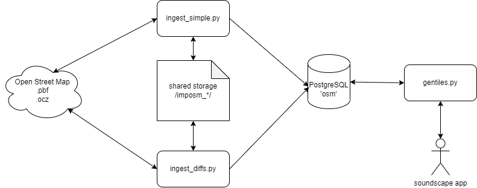

# soundscape-backend
Code for the backend services for soundscape

The backend of Soundscape consists of four parts:

1. Ingestion service that takes data from Open Street Maps (OSM) in .pbf form and transforms to PostGIS format.
2. PostgreSQL database with PostGIS extension installed to store the output of the Ingestion service.
3. Tile service that allows the database to be queried and outputs a .json file in GeoJSON format.
4. Ingestion Updates service that takes any changes from OSM and applies them to the database in a two minute cycle.

If you want to have a local dev environment running in Docker. Then clone the repo, navigate to Docker/ and from a terminal: 

docker compose up

This will spin up a stack containing four Docker containers with the services described above. You will be able to perform a quick test that it is working by using a browser/curl/whatever to hit the Tile service which is listening on 8080 and it should respond with a GeoJSON file for the Washington Capitol Building: 

http://localhost:8080/16/18748/25072.json

The request above is in the format: /zoom-level/x-coordinates/y-coordinates.json The service currently only supports zoom level 16

# Ingestion Service

The Ingestion service is a Python file (ingest_simple.py) which gets Open Street Map data and transform it into PostGIS format using the Imposm program and uses the mapping.yml file to transform the data. Imposm then connects to the PostgreSQL database and writes the data to the db.

The Open Street Map data can be in the form of a singular extract (district-of-columbia-latest.osm.pbf) or multiple extracts. The service uses the extracts.json file to know which and where to get the extracts from. The .pbf file is a compressed file format that OSM uses to distribute their data.

Imposm then performs a transform of the OSM data using the mapping.yml file and writes the files to storage in an intermediate format using levelDB. If you have used the Docker Compose file to bring up the environment then you will find all of the intermediate data in the data_tiles volume.

The final steps that Imposm takes are reading the intermediate format and writing the data to the PostgreSQL database. It then performs indexing of the data to improve performance.

# Ingestion Service Updates

Imposm can be configured to perform updates to the database as the OSM data is updated at source. The configuration file is config.json which tells Imposm where and when to get the updates and the Python file which uses that is ingest_diffs.py. If you have set this up with the Docker Compose file then it will be off by default and you will need to bring it up if you want updates. The update service depends on the files contained in imposm_cache which were generated on the initial import process and you should not make any changes to mapping.yml or it will corrupt the database.

# PostgreSQL with PostGIS extensions

The database is used for storage of the transformed data. Imposm creates a database 'osm' and within that there are three schema: 
1. import
2. production
3. backup.

The schemas consist of three tables: 
1. osm_entrances
2. osm_places
3. osm_roads

There is a PostgreSQL function (soundscape_tile) that the Tile service uses to retrieve data:  

tilefunc.sql

This takes the zoom, x and y coordinates and returns the GeoJSON for the bounding box defined by x and y.

The bounding box function (TileBBox) that tilefunc.sql uses is defined in:

postgis-vt-util.sql

# Tile Service

The tile service is gentiles.py and uses the aiohttp async web framework to provide a simple interface to allow the database to be queried. It expects a GET request in the /z/x/y format discussed above:
'/{zoom}/{x}/{y}.json'

It also has a /metrics interface which returns statistics about tiles served, errors, etc. and a /probe/alive interface to check if the service is up.
